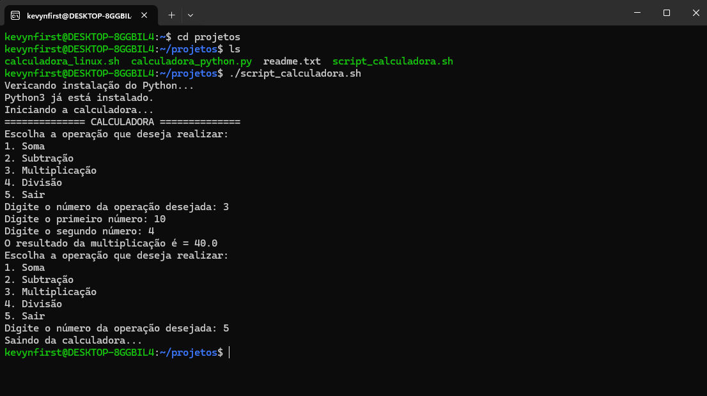

<p align="center">
  
</p>
<p align="center">
Projeto de um script shell de uma calculadora dinamica em python
</p>
<p align="center">
  <a href="#-tecnologias">Tecnologias</a>&nbsp;&nbsp;&nbsp;|&nbsp;&nbsp;&nbsp;
  <a href="#-projeto">Projeto</a>&nbsp;&nbsp;&nbsp;|&nbsp;&nbsp;&nbsp;
  <a href="#-preview">Preview</a>
</p>

<p align="center">
  
  	  
</p>

<br>

## 🚀 Tecnologias

Esse projeto foi desenvolvido com as seguintes tecnologias:

- [Python](https://www.python.org/)
- [Linux Ubuntu](https://ubuntu.com/desktop/wsl)
- [Git](https://git-scm.com)
  <br>
  <br>

## 📖 Projeto

Este projeto faz parte da prática do curso [Profissão de Analista de Dados da EBAC](https://ebaconline.com.br/analista-de-dados),
onde consiste na criação de uma calculadora em linguagem python, para ser executado em um script em um ambiente Linux.
<br>
<br>

### Explicação do Código em Python

O código em Python implementado no arquivo `calculadora_python.py` realiza o seguinte:

<b>1.</b> O programa apresenta um menu para que o usuário escolha a operação desejada:
<br>&nbsp;&nbsp;&nbsp; 1. Soma;
<br>&nbsp;&nbsp;&nbsp; 2. Subtração;
<br>&nbsp;&nbsp;&nbsp; 3. Multiplicação;
<br>&nbsp;&nbsp;&nbsp; 4. Divisão;
<br>&nbsp;&nbsp;&nbsp; 5. Sair;

<b>2.</b> O usuário insere dois números para realizar a operação selecionada;

<b>3.</b> Com base na escolha, o programa realiza o cálculo correspondente:
<br>&nbsp;&nbsp;&nbsp; 1. Soma = `num1 + num2`;
<br>&nbsp;&nbsp;&nbsp; 2. Subtração = `num1 - num2`;
<br>&nbsp;&nbsp;&nbsp; 3. Multiplicação = `num1 * num2`;
<br>&nbsp;&nbsp;&nbsp; 4. Divisão = `num1 / num2`;

<b>4.</b> Caso o usuário escolha "Sair", o programa encerra com uma mensagem de despedida;

<b>5.</b> Vai ser feito uma Validação, Inclui verificações de entrada para evitar operações
inválidas, como divisões por zero ou operações não reconhecidas.
<br>
<br>

## 🖥 Preview

<p align="center">
  
</p>

### Como Executar

Certifique-se que os arquivos `calculadora_python.py` e `script_calculadora.sh` estejam no mesmo diretorio no seu ambiente linux, basta [baixa-los por aqui](https://github.com/KevynFirst/projeto-calculadora/blob/630c41433761c062584bad3fccbb3524f49052b8/projeto-calculadora.rar). 👈🏻
<br>

Agora vamos dar permissão de execução do arquivo, utilizando o comando:

```bash
chmod +x script_calculadora.sh
```

<br>

Execute o script no terminal:

```bash
./calculadora_python.sh
```

<br>
<br>

## 😉 Obrigado por visitar meu projeto

<p>Você pode conferir outros projetos que desenvolvi aqui no meu GitHub, ou entrar em contato comigo pelos demais links.</p>

<a href = "mailto:kevynfirst@gmail.com"></a>
<a href="https://instagram.com/kevynfirst" target="_blank"></a>
<a href="https://www.linkedin.com/in/kevynfirst" target="_blank"></a>
